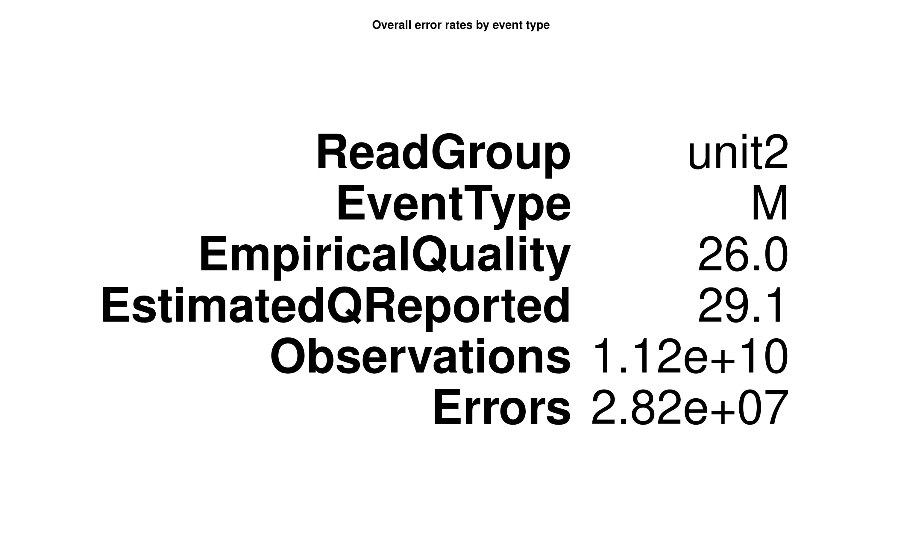

```{css, echo=FALSE}

.header-panel h1 {
    color: #FFF;
    font-size: 80px;
    padding-left: 35px;
    font-weight: 500;
}

.header-panel {
  background-color: #00adb5;
}

 .pages h1 {
   color: #cdc733;
   font-size: 45px;
   font-weight: 400;
 }
 
#  .h1, h1 {
#     font-family: Impact;
# }
 
.h2, h2 {
    font-size: 24px;
    background-color: #ededd0;
    color: #cdc733;
}

a, a:focus, a:hover {
    color: #cdc733;
}

.nav-pills > li.active > a, .nav-pills > li.active > a:focus, .nav-pills > li.active > a:hover {
    color: rgb(255, 255, 255);
    background-color: #cdc733;
}

code {
    padding: 2px 4px;
    font-size: 90%;
    color: #cdc733;
    background-color: #ededd0;
    border-radius: 4px;
}

```

```{r setup, include=FALSE}
library(knitr)
library(rmdformats)
library(questionr)
## Global options
options(max.print = "75")
opts_chunk$set(echo = TRUE,
               eval = FALSE,
	             cache = FALSE,
               prompt = FALSE,
               tidy = FALSE,
               comment = NA,
               message = FALSE,
               warning = FALSE)
opts_knit$set(width = 75)
options("citation_format" = "pandoc")
```

# Introduction

`Bladder cancer` is one of the most common cancers worldwide, with transitional cell carcinoma (TCC) being the predominant form. It has being estimated 386,300 new cases and 150,200 deaths in the coming years.

Previous studies showed that bladder cancer represents a heterogeneous disease, with two distinct subtypes- superficial and invasive-showing variable clinical presentation and genetic background such us mutations in chromatin-remodeling genes (`UTX, MLL-MLL3, CREBBPEP300, NCOR1, ARID1A and CHD6`). Nevertheless, the comprehension of bladder cancer alterations is far from complete, and the key drivers of TCC tumor genesis remain poorly understood.

### Objective :

>  The objective of this project is to compare sequence data variants between tumor and normal patient samples from `whole genome sequence data` (WGS).

For this, the fastaq files of 28 samples were downloaded, the genome was indexed and the corresponding BAMs were generated. The variant calling (vc) process was applied using the GATK (Genome Analysis Toolkit), the results of which were analyzed with Ensembl. 


### What is a DNA-seq pipeline?
The `bioinformatics pipeline` for a typical DNA sequencing strategy involves aligning the raw sequence reads from a FASTQ or unaligned BAM file against the human reference genome.
The aligned sequences and the related metadata are stored in a Sequence Alignment Mapping (SAM/BAM) or CRAM file format. Downstream algorithms consume the BAM file to identify a range of genetic alterations, including `single nucleotide` `variants`, `insertions and deletions (indels)`, and `tumor mutation burden`.  [(AACC)](https://www.aacc.org/cln/articles/2020/march/next-generation-sequencing-bioinformatics-pipelines). 


# Data Preprocessing Steps

## Important paths definition...
Different important paths for the realization of this pipeline are defined below: In pathSamples the directory in which the downloaded samples were saved is defined. On the other hand, pathGenome contains the directory to the fasta file of the GRCh38 reference human genome (hg38). For more information about this genome see [NCBI](https://www.ncbi.nlm.nih.gov/assembly/GCF_000001405.26/).
In path_gak the directory to GATK is saved, which is one of the most powerful and well-documented tools avaliable for calling variants. Finally, in pathOutput we will indicate the directory in which we will save our results.

```{r eval=TRUE}
pathSamples<-"/datos/mgimeno/NGS/Samples"
pathGenome<-"/datos/mgimeno/NGS/FinalAssessment/hg38.fa"
pathOutput<-"/datos/mgimeno/NGS/FinalAssessment/DNA_analysis/"
path_gatk <- '/datos/mgimeno/NGS/FinalAssessment/gatk-4.1.6.0/gatk'
```

## Information of samples
Below is a table with the 28 genome sequence data (WGS) samples obtained from [FTP](http://ftp.ebi.ac.uk/vol1/fastq/ webserver). 
As indicated in column X17 and X24, for each “Bxx” patient there is a Cancer sample and a Normal sample, and the samples have paired-end reads (both ends of the fragments are sequenced which allows users  to generate high-quality, alignable sequence data). Sequencing was obtained using the Illumina Genome Analyzer II instrument from the Illumina brand.

```{r eval=TRUE}
library(readr)
#selected<-read_delim("/datos/mgimeno/NGS/FinalAssessment/DNA_analysis/TablaFinal_DNA.csv", 
#                     ";", escape_double = FALSE, col_names = FALSE, trim_ws = TRUE)
selected<-read_delim("TablaFinal_DNA.csv", 
                     ";", escape_double = FALSE, col_names = FALSE, trim_ws = TRUE)

selected<-selected[-29,] 
```

```{r dt, eval=TRUE}
library(DT)
DT::datatable(selected)
```

## Fastq
- `FASTA`: a text-based format to represent nucleotide or protein sequences.
- `FASTAQ`: An extension of the FASTA format is FASTQ format. This format is designed to handle base quality metrics output from
sequencing machines. In this format, both the sequence and quality scores are represented as single ASCII characters.
The compressed paired fastqs were downloaded using the axel command, which is equivalent to wget but it can open more than just one connection. In many cases, download using axel is faster than using wget.

```{r}
namesoutput<-selected$X14

command1 <- paste0("axel -n 8 -a http://ftp.ebi.ac.uk/vol1/fastq/",substring(namesoutput,1,6),"/",namesoutput,"/",namesoutput,"_1.fastq.gz .") 
command2 <- paste0("axel -n 8 -a http://ftp.ebi.ac.uk/vol1/fastq/",substring(namesoutput,1,6),"/",namesoutput,"/",namesoutput,"_2.fastq.gz .")

commandAll <- as.vector(rbind(command1,command2))
system(commandAll)
```
Where namesoutput is a list with the names of the samples appeared in column 14 of the previous table.


# Index Construction

We have to build three indexes as follows...
```{r}
commandIndex <- paste0("samtools faidxx ",pathGenome) # Reference genome index
system(commandIndex)

commandIndex2 <- paste0("java -jar /datos/mgimeno/NGS/FinalAssessment/picard.jar CreateSequenceDictionary REFERENCE=",pathGenome) # Creates .dict
system(commandIndex2)

commandIndex3 <- paste0("bwa index ",pathGenome) # Creates .fai
system(commandIndex3)
```
> `Picard` is a set of command line tools for manipulating high-throughput sequencing (HTS) data. Starting with version 4.0, gatk contains a copy of the Picard toolkit, so all Picard tools are available from within GATK itself.


# Alignment and sort

The 28 samples were analyzed by different members of our team as follows : 

- hpc1 Tomás Muñoz Santoro --> From 1 to 7
- hpc3 Katyna Sada Del Real --> From 8 to 14
- hpc4 Joseba Sancho Zamora --> From 15 to 21
- hpc5 Cristina Tobías Figuerola --> From 22 to 28

```{r eval=TRUE}
tomas <- 1:7
katyna <- 8:14
joseba <- 15:21
cris <- 22:28
samplesToAnalyze <- katyna # Define the samples to analyze
```


First, folders for all samples were created.
```{r}
for (i in samplesToAnalyze){
  commandFolders <- paste0('mkdir ', pathOutput, namesoutput[i])
  system(commandFolders)
}
```


> The Sequence Alignment Map Format  (SAM) is a tab-delimited text file that contains sequence alignment data. 
> A BAM file (. bam) is the binary version of a SAM file, which takes up much less space. 

In this step of the pipeline the .bam files were created from the .sam files of the samples.
- With the command commandSAM `we create the .sam file` from the `fastaq` files.
- `Read groups are aligned` to the reference genome using BWA software (mean read length should be greater or equal to 70bp, otherwise bwa aln must be used). The bwa mem can tag -and group- sets of reads generated from a single run of a sequencing instrument.
In our case, bwa mem performs the mapping using 10 threads.
- With commandBAM and commandSAMremove we `create the .bam files` and `remove the .sam` files, respectively.

```{r}
for (i in samplesToAnalyze){
  samples<-dir(path = pathSamples,pattern = namesoutput[i])
  commandSAM<-paste0("nice bwa mem -t 10 ", pathGenome, " ", pathSamples, '/',samples[1], " ", pathSamples, '/',samples[2], " > ",
                    pathOutput,namesoutput[i],".sam "  ) # Create .sam
  system(commandSAM)
  
  commandBAM<-paste0("nice samtools view -@ 10 -S -b ", pathOutput,namesoutput[i],".sam > ",  pathOutput,namesoutput[i],".bam") # Create .bam
  commandSAMremove<-paste0("rm ", pathOutput,namesoutput[i],".sam") # Remove .sam (many GB)
  system(commandBAM)
  system(commandSAMremove)
}
```


We then `sort the .bam` files with samtools.
```{r}
for (i in samplesToAnalyze){
  commandSort<-paste0("nice samtools sort -@ 10 ",pathOutput,namesoutput[i],".bam ",pathOutput,namesoutput[i]," ") # SORT
  system(commandSort) 
}
```
The sorted .bam replaces the older ones, so there’s no need to remove them.

Finally, the `index the .bam` files is created using samtools.
```{r}
for (i in samplesToAnalyze){
  commandBAI<-paste0("samtools index ", pathOutput,namesoutput[i], ".bam" ) # Creates .bai
  system(commandBAI) 
}
```

# Pipeline

##  {.tabset .tabset-fade .tabset-pills}
<center>
  
</center>
### AddOrReplaceReadGroups

Adding read group information. It `assigns all the reads in a file to a single new read-group`.
```{r}
for (i in samplesToAnalyze){
  commandReadGroup<-paste0("java -jar /datos/mgimeno/NGS/FinalAssessment/picard.jar AddOrReplaceReadGroups I=",
                    pathOutput,namesoutput[i], ".bam O=", pathOutput,namesoutput[i], ".rg.bam SO=coordinate RGID=",
                    pathOutput,namesoutput[i]," RGLB=LB1 RGPL=Illumina RGPU=unit2 RGSM=", pathOutput,namesoutput[i])
  system(commandReadGroup)

  commandReadGroupIndex<-paste0("samtools index ", pathOutput,namesoutput[i], ".rg.bam" )
  system(commandReadGroupIndex)
}
```


### MarkDuplicates
This step `locates and tags duplicate` reads in our BAM file. Duplicates can arise during sample preparation e.g. library construction using PCR and can also result from a single amplification cluster, incorrectly detected as multiple clusters by the optical sensor of the sequencing instrument.

MarkDuplicates also produces a metrics file indicating the numbers of duplicates for both single- and paired-end reads.
```{r}
for (i in samplesToAnalyze){
  commandMarkDup<-paste0("java -jar /datos/mgimeno/NGS/FinalAssessment/picard.jar MarkDuplicates I=",
                    pathOutput,namesoutput[i], ".rg.bam O=", pathOutput,namesoutput[i], ".dupmark.bam METRICS_FILE=",
                    pathOutput,namesoutput[i],".dupmark.stats REMOVE_DUPLICATES=FALSE")
  system(commandMarkDup)
}
```

Folders permissions are given so that all users can access the files...
```{r}
for (i in samplesToAnalyze){
  commandMove <- paste0('mv ', pathOutput,'*',namesoutput[i],'* ', pathOutput,namesoutput[i]) # Move files to their folders (if they are not already in them)
  system(commandMove)

  commandPermissions1 <- paste0('chmod a+rwx ', pathOutput,namesoutput[i])
  system(commandPermissions1)

  commandPermissions2 <- paste0('chmod a+rwx ', pathOutput,namesoutput[i],'/',namesoutput[i],'*')
  system(commandPermissions2)
}
```


### vcf generation 
Variant calling is the process by which we `identify variants from sequence data`. It can be a somatic vc (where the reference is a related tissue from the same individual) or a germline vc (where the reference genome is the standard for the species of interest). Germline vc allows us to identify genotypes.

As most genomes are diploid, we expect to see that at any given locus, either all reads have the same base, indicating homozygosity, or approximately half of all reads have one base and half have another, indicating heterozygosity.
In this pipeline we will be using HaplotypeCaller, which is a straightforward technique that identifies where the aligned reads (sample) differ from the reference genome and write to a vcf file. 
```{r}
system('sudo update-java-alternatives --set /usr/lib/jvm/java-1.8.0-openjdk-amd64') # Change the java version (not necessary)

for (i in samplesToAnalyze){
  path_dup<-paste0(pathOutput,namesoutput[i])
  command_vcf<-paste0(path_gatk, ' HaplotypeCaller ',
                      '--native-pair-hmm-threads 4 ',
                      '-I ', path_dup,'/',namesoutput[i],'.dupmark.bam ',
                      '-R ', pathGenome, ' ',
                      '-O ', path_dup,'/',namesoutput[i],'_snps_indels_g.vcf')
  system(command_vcf)
}
```
As an *input argument* the `.bam files with marked duplicates` and the reference genome were introduced, and as output a vcf file was generated using HaplotypeCaller. Four threads were used for this task.


### vcf reports
Through this process systematic errors in base `quality scores` are detected and a recalibration table is generated based on various user-specified covariates (such as read group, reported quality score, machine cycle, and nucleotide context).

As an input argument the .bam files with marked duplicates, the reference genome and the regions of interest through the vcf file were introduced, and a table with the results of the calibration was generated as an output.
```{r}
for (i in samplesToAnalyze){
  command_vcfreports <-paste0(path_gatk, ' BaseRecalibrator ',
                              '-R ', pathGenome, ' ',
                              '-I ', path_dup,'/',namesoutput[i],'.dupmark.bam ',
                              '--known-sites ', path_dup,'/',namesoutput[i],'_snps_indels_g.vcf ',
                              '-O ', path_dup,'/',namesoutput[i],'_report.table')
  
  
  system(command_vcfreports)
}
```

#### R package for analyzing vcf reports files
```{r}
#install.packages("gsalib")
library(gsalib)
for (i in samplesToAnalyze){
  commandVal <- paste0(namesoutput[i],'report <- gsa.read.gatkreport("',path_dup,'/',namesoutput[i],'_report.table','")') 
  eval(parse(text=(commandVal)))
}
```


### Base quality recalibration (BQSR)
Base quality score recalibration (BQSR) is a process in which we apply machine learning to `model quality score errors` empirically and adjust the quality scores accordingly. This allows us to get more accurate base qualities, which in turn improves the accuracy of our variant calls.

For each  of the samples we introduce as input the same .bam files, and the report table of the previous vcf, and we obtain as output the recalibrated .bam files.
```{r}
for (i in samplesToAnalyze){
    commandBSRecal <- paste0(path_gatk, ' ApplyBQSR ',
                           '-I ', path_dup,'/',namesoutput[i],'.dupmark.bam ',
                           '--bqsr ', path_dup,'/',namesoutput[i],'_report.table ',
                           '-O ', path_dup,'/',namesoutput[i],'_output_recalibrated.bam')
  system(commandBSRecal)
}
```


### vcf recalibrated files
Next, a new HaplotypeCaller is performed to identify where the aligned reads differ from the reference genome using the recalibrated .bams and we again obtain the corresponding vcf files.
```{r}
for (i in samplesToAnalyze){
  commandRecal <- paste0(path_gatk, ' HaplotypeCaller ',
                         '-I ', path_dup,'/',namesoutput[i],'_output_recalibrated.bam ',
                         '-R ', pathGenome, ' ',
                         '-O ', path_dup,'/',namesoutput[i],'_snps_indels_g_rec.vcf')
  system(commandRecal)
}
```

# Reports

## vcf recalibrated files reports
```{r}
for (i in samplesToAnalyze){
  commandRecalReport <- paste0(path_gatk, ' BaseRecalibrator ',
                               '-I ', path_dup,'/',namesoutput[i],'_output_recalibrated.bam ',
                               '-R ', pathGenome, ' ',
                               '--known-sites ', path_dup,'/',namesoutput[i],'_snps_indels_g.vcf ', #TENEMOS QUE VER PORQUE USA EL VCF ORIGINAL Y NO EL REC
                               '-O ', path_dup,'/',namesoutput[i],'_recalibrated_report.table')
  system(commandRecalReport)
}
```

## Report Covariates construction
As shown on the next chunk, gatk AnalyzeCovariates creates a pdf report with the recalibration result and statidistics.
```{r}
for (i in samplesToAnalyze){
  commandRecalReport <- paste0(path_gatk, ' AnalyzeCovariates ',
                               '--before ', path_dup,'/',namesoutput[i],'_report.table ',
                               '--after ', path_dup,'/',namesoutput[i],'_recalibrated_report.table ',
                               '--plots ', path_dup,'/',namesoutput[i],'_recalibrated_report.pdf')
  
  system(commandRecalReport)
}
```

### 274
<center>
  
</center>

<center>
  
</center>

<center>
  
</center>

<center>
  
</center>

<center>
  
</center>


### 275

<center>
  
</center>

<center>
  
</center>

<center>
  
</center>

<center>
  
</center>

<center>
  
</center>

```{r}
system('sudo update-java-alternatives --set /usr/lib/jvm/java-1.11.0-openjdk-amd64') # Go back to the standard version of java
```


# IGV Results

## TP53 sample 274 and 275
<center>
  
</center>

<center>
  
</center>

## TP53 sample 222 and 223
<center>
  
</center>

## CREBBP sample 274 and 275
<center>
  
</center>

<center>
  
</center>

## CREBBP sample 222 and 223
<center>
  
</center>

<center>
  
</center>

<center>
  
</center>

## Sample 274 recalibrated vs. not recalibrated
<center>
  
</center>

## Sample 275 recalibrated vs. not recalibrated
<center>
  
</center>

# Ensembl Results
 - [Sample 274](https://may2021.archive.ensembl.org/Homo_sapiens/Tools/VEP/Results?tl=7QwOASYkErKEihmX-7315247)
 - [Sample 275](https://may2021.archive.ensembl.org/Homo_sapiens/Tools/VEP/Results?tl=bYDBjDYZ5EEeKPdW-7315253)
 
 
